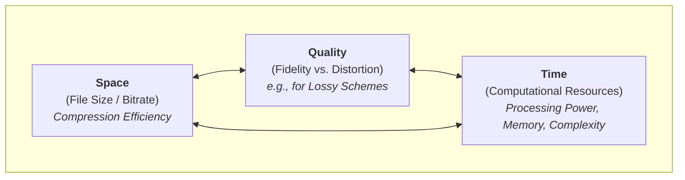
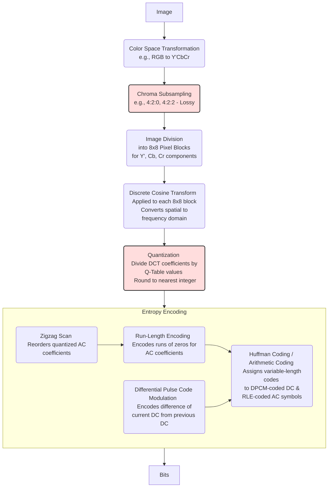

## **I. Concepts, Terminology, and Principles**

### Common Concepts and Terminology
* **Lossless Compression / Lossy Compression / The interdependent triangle**  
  * **Lossless compression**  techniques reduce the size of data by identifying and eliminating statistical redundancy without discarding any information from the original source. This means that the original data can be perfectly reconstructed, bit for bit, from the compressed version. Lossless compression is essential in scenarios where data integrity is paramount and no loss of information is tolerable. This includes executable programs, text documents, source code, and certain types of archival data. In image compression, formats like PNG (Portable Network Graphics) and GIF (Graphics Interchange Format) utilize lossless techniques. Lossless compression is also frequently employed as a stage within lossy compression schemes, for example, to compress motion vectors or the quantized transform coefficients after the primary lossy steps have been applied.
  * **Lossy compression**  achieves significantly higher compression ratios than lossless methods by permanently discarding some information from the original data. The key principle is to remove data that is considered less important or less perceptible to human senses. For images and video, this often involves transforming the data into a domain (like the frequency domain using DCT) where perceptual importance can be more easily assessed, followed by quantization, where less important information (e.g., high-frequency details or subtle color variations) is represented with less precision or discarded entirely. Chroma subsampling[^Chroma] is another common lossy technique specific to color video. The original data cannot be perfectly reconstructed from the compressed version; only an approximation is recovered. There is a fundamental trade-off for lossy compression between the degree of compression (file size or bitrate) and the resulting quality (fidelity to the original). Lossy compression is ubiquitous in multimedia applications due to its ability to drastically reduce file sizes. Common examples include JPEG for still images, MP3 and AAC for audio, and nearly all modern video formats such as MPEG-2, H.264/AVC, and H.265/HEVC.
  * **The interdependent triangle** is a critical ballance to be managed by the codec between three factors: space (file size/bitrate), quality (distortion), and time (complexity). This involves the compression efficiency (how much the data size is reduced, often measured by bitrate), the amount of distortion introduced (particularly in lossy schemes, measured by fidelity to the original), and the computational resources (processing power, memory, and time) required for both encoding and decoding. Improving one aspect often comes at a cost to one or both of the others. 

* **Encoder / Decoder**
    * An **encoder** is a device or, more commonly in modern systems, a software algorithm that transforms information from its original representation into a coded format, which is typically compressed. A **decoder** is a device or software algorithm that performs the inverse operation of an encoder. Its function is to convert the encoded (compressed) data bitstream back into a representation of the original information. The encoder and decoder are not standalone entities but rather two integral halves of a complete system, defined by a specific codec or standard. The bitstream generated by the encoder is meticulously structured with syntax and semantics that a compatible decoder is designed to interpret. The encoder makes numerous decisions during the compression process (e.g., which prediction modes to use, what quantization levels to apply) and signals these choices within the bitstream. The decoder must parse these signals correctly and apply the precise inverse processes to reconstruct the media. This tight coupling necessitates strict adherence to standardized specifications to ensure interoperability across different media and platforms.
    * Common hardware codecs in GPUs or specialized System-on-Chips (SoCs) include: NVIDIA (NVENC/NVDEC)[^NVIDIA], Apple (A-series and M-series chips)[^Apple]. Common software codecs are: x264[^x264]/x265[^x265], libavcodec(Ffmpeg)[^ffmpeg], libaom (Alliance for Open Media)[^libaom].

* **Container Format / Codec**
    * A **container format**, also known as a wrapper format or media container, is a file format whose specification describes how different data elements and metadata coexist in a computer file. In the context of digital media, its primary purpose is to bundle various data streams together into a single file. A **codec (Coder-Decoder)** is an algorithm or software/hardware implementation responsible for the actual compression (encoding) and decompression (decoding) of the audio and video data streams (e.g., H.264 is a video codec, AAC is an audio codec). The container format, on the other hand, does not dictate the compression method itself; rather, it defines how the already compressed data (produced by one or more codecs) and any associated information are organized, stored, and interleaved within a single file. 
    * **Multiplexing (muxing)** is the process of combining separate elementary streams into a single, cohesive bitstream suitable for storage or transmission, without changing the codec itself. In contrast, video **transcoding** is a broader scope of converting a video file from one digital format to another. This is a comprehensive operation that can involve changing one or more parameters of the video, including: the video codec and parameters (e.g., resolution), the audio codec and parameters (e.g., sample rate), and the container format.

### Principles: Reducing Data Redundancy and Visual Redundancy

1.  **Exploiting and Eliminating Redundancy:**
    Digital images and videos inherently contain a lot of repetitive or predictable information. The compression mindset seeks to identify and remove this redundancy in a way that either allows for perfect reconstruction (lossless) or minimizes noticeable loss (lossy).
    *   **Spatial Redundancy (Within a single image or video frame):** Images often have areas with similar or identical pixel values, like a large patch of blue sky or a plain wall. Instead of storing each pixel's data individually, compression techniques find more compact ways to represent these uniform regions.
    *   **Temporal Redundancy (Between consecutive video frames):** In a video, much of the scene often remains the same from one frame to the next, or objects move in predictable ways. Video compression heavily relies on this by encoding only the *differences* between frames or by describing how blocks of pixels have moved (motion estimation and compensation). 
    *   **Statistical Redundancy (Coding Redundancy):** Some pixel values or symbols appear more frequently than others in image or video data. Entropy encoding methods, like Huffman coding or Arithmetic coding, assign shorter binary codes to more common symbols and longer codes to rarer ones, reducing the overall bit count without losing information.

2.  **Leveraging the Limits of Human Perception**
    This is the cornerstone of *lossy* compression, which achieves much higher compression ratios by permanently discarding some information.The mindset here is to be selective about what data is thrown away, focusing on information that the human visual system is less sensitive to or is unlikely to perceive.
    *   **Psycho-visual Redundancy:**
        *   **Sensitivity to Brightness over Color:** The human eye is more sensitive to changes in brightness (luma) than to changes in color (chroma). Compression techniques exploit this through *chroma subsampling*[^Chroma], where color information is stored at a lower resolution than brightness information, leading to significant data savings with often imperceptible impact on visual quality.
        *   **Sensitivity to Spatial Frequencies:** We are generally less able to perceive very fine details or rapid changes (high spatial frequencies) compared to larger, smoother areas (low spatial frequencies). Transforms like the Discrete Cosine Transform (DCT), used in JPEG, convert image blocks into frequency components. This "energy compaction" concentrates most of the visually important information into a few low-frequency coefficients. The less critical high-frequency coefficients can then be *quantized* more aggressively—represented with less precision or even discarded entirely—further reducing data size.

## **II. Image Compression (JPEG)**

### Standardizing Body: JPEG (Joint Photographic Experts Group)
JPEG refers to both the committee, the Joint Photographic Experts Group, and the widely implemented image compression standard they developed. The foundational standard is formally designated as ISO/IEC 10918-1[^JPEGISO]. 

### JPEG encoding pipeline

Recommendation: [Explainer video by Branch Education](http://www.youtube.com/watch?v=Kv1Hiv3ox8I)

1.  **Color Space Transformation (e.g., RGB to Y'CbCr):**
    *   **Purpose:** Digital images are often captured or represented in the RGB (Red, Green, Blue) color space. For compression, JPEG often converts the image data into a color space like Y'CbCr[^YCbCr]. The human eye is more sensitive to changes in brightness (luma) than to changes in color (chroma).[4, 8, 6, 9, 10] This separation allows the chroma components to be compressed more aggressively in subsequent steps.
    *   **Process:**
        *   **Y' (Luma):** Represents the brightness or luminance component (the black and white information) of the image.
        *   **Cb and Cr (Chroma):** Represent the blue-difference and red-difference color components, respectively.

2.  **Chroma Subsampling (Downsampling):**
    *   **Purpose:** To reduce the amount of color data based on the human visual system's lower acuity for color detail. This is a lossy step. This step significantly reduces the amount of data for the color channels with minimal perceived impact on image quality for most images.
    *   **Process:** The Cb and Cr (chroma) components are sampled at a lower spatial resolution than the Y' (luma) component. Common schemes include:
        *   **4:4:4:** No subsampling. Luma and chroma have the same resolution.
        *   **4:2:2:** Chroma is sampled at half the horizontal resolution of luma.
        *   **4:2:0:** Chroma is sampled at half the horizontal and half the vertical resolution of luma. This is very common.

3.  **Image Division into 8x8 Pixel Blocks:**
    *   **Purpose:** To prepare the image data for the Discrete Cosine Transform (DCT).
    *   **Process:** Each component of the image (Y', Cb, and Cr, after any subsampling) is divided into non-overlapping 8x8 blocks of pixels. If the dimensions of a component are not a multiple of 8, padding might be applied.

4.  **Discrete Cosine Transform (DCT):**
    *   **Purpose:** To convert the spatial information of each 8x8 pixel block into frequency domain information. The DCT has excellent "energy compaction" properties, meaning it concentrates most of the visually significant information into a few coefficients. By transforming to the frequency domain, it becomes easier to separate perceptually important information (low frequencies) from less important information (high frequencies). The DCT itself is not lossy, except for potential rounding errors in computation.
    *   **Process:** A 2D DCT (typically Type-II DCT) is applied to each 8x8 block. This transforms the 64 pixel values into 64 DCT coefficients.
        *   The top-left coefficient is the **DC coefficient**, representing the average value of the 64 pixels in the block.
        *   The other 63 coefficients are **AC coefficients**, representing successively higher spatial frequencies (details and textures).

5.  **Quantization:**
    *   **Purpose:** This is the primary lossy step in JPEG compression. It reduces the precision of the DCT coefficients, especially the high-frequency ones that are less perceptible to the human eye.
    *   **Process:** Each of the 64 DCT coefficients in a block is divided by a corresponding value from an 8x8 **Quantization Matrix** (also called a Q-table), and the result is rounded to the nearest integer.
        *   JPEG typically uses two Q-tables: one for the luma component and one for the chroma components (which are usually more aggressively quantized).
        *   The values in the Q-table are larger for higher-frequency AC coefficients, leading to more aggressive compression (many become zero) for those details. The "quality" setting in JPEG encoders often scales these Q-table values.
   

6.  **Entropy Encoding:**
    This is a lossless stage that further compresses the quantized DCT coefficients. It typically involves several sub-steps:
    *   **Zigzag Scan:**
        *   **Purpose:** To group low-frequency coefficients (which are more likely to be non-zero after quantization) together and create long runs of zeros for high-frequency coefficients.
        *   **Process:** The 63 AC coefficients in each 8x8 quantized block are read out in a zigzag pattern, from the top-left (low frequency) to the bottom-right (high frequency).
    *   **Run-Length Encoding (RLE) for AC Coefficients:**
        *   **Purpose:** To efficiently encode the many zero-valued AC coefficients that result from quantization, especially after the zigzag scan.
        *   **Process:** Instead of coding each zero, RLE typically encodes a pair: `(run_length_of_preceding_zeros, next_non_zero_AC_coefficient_value)`. A special End-of-Block (EOB) code (often (0,0)) indicates that all remaining AC coefficients in the block are zero.
    *   **Differential Pulse Code Modulation (DPCM) for DC Coefficients:**
        *   **Purpose:** To exploit the correlation between the DC coefficients of adjacent 8x8 blocks (average block intensities often change gradually).
        *   **Process:** Instead of encoding the absolute value of each DC coefficient, the difference between the current block's DC coefficient and the DC coefficient of the *previous* block is encoded.
    *   **Huffman Coding (or Arithmetic Coding):**
        *   **Purpose:** To assign shorter binary codes to more frequently occurring symbols (DPCM-coded DC values and RLE-coded AC pairs) and longer codes to less frequent ones.
        *   **Process (Huffman):**
            *   For DC coefficients, the *category* (size in bits) of the DPCM difference is Huffman coded, followed by the actual bits of the difference.
            *   For AC coefficients, the combined `(run_length, category_of_next_non_zero_AC_coefficient)` symbol is Huffman coded, followed by the actual bits of the non-zero AC coefficient.
        *   **Arithmetic Coding:** An alternative, often slightly more efficient entropy coding method also specified in the JPEG standard, but less commonly used due to historical patent issues and wider Huffman support.

The result of these steps is a compressed bitstream representing the image, which is then typically wrapped in a file format like JPEG. The decompression process essentially reverses these steps, using the stored Q-tables and Huffman tables to reconstruct an approximation of the original image.

### Further Notes
  * **The basis function.** For image compression, ideal basis functions should possess several properties: they should allow the energy (or information content) of typical image signals to be "compacted" into a relatively small number of transform coefficients; they should be computationally efficient to calculate; and they should ideally have good decorrelation properties, meaning they transform correlated pixel data into less correlated coefficients.
  * **The trade-off.** The Quantization Matrix serves as the direct control mechanism for the lossiness and, consequently, the compression-versus-quality trade-off in JPEG. The specific values chosen for the 64 entries in this matrix (often scaled by a single "quality" factor in user interfaces) dictate precisely how much information is discarded from each corresponding frequency component of the DCT. By employing larger divisor values for high-frequency DCT coefficients (to which the human visual system is less sensitive) and smaller divisor values for the DC and low-frequency AC coefficients (which are more critical for perceived quality), JPEG tailors the information loss profile to align with human visual perception.
  * **The scanning order.** The zigzag scanning pattern applied to the quantized AC coefficients before RLE is not an arbitrary choice. It systematically orders the coefficients from the lowest spatial frequencies (excluding the DC coefficient, which is handled separately) to the highest. This ordering is synergistic with the effects of DCT and quantization: since high-frequency coefficients are more likely to be quantized to zero, the zigzag scan tends to create longer contiguous runs of zeros. This, in turn, maximizes the effectiveness of Run-Length Encoding[^Huffman], as RLE achieves greater compression when it encounters longer sequences of identical symbols.

## **IV. Video Compression (H.26x)**

### Standardizing Bodies: M-JEPG, MPEG, H.26x
  * **Motion-JPEG (M-JPEG)** is a straightforward video compression format where each individual frame of the video sequence is compressed independently using the JPEG still image compression standard.34 Essentially, an M-JPEG stream is a sequence of complete JPEG images.  
  * **MPEG (Moving Picture Experts Group)** is a working group operating under the joint auspices of ISO (International Organization for Standardization) and IEC (International Electrotechnical Commission), specifically as part of ISO/IEC JTC 1/SC 29 (Coding of audio, picture, multimedia and hypermedia information). MPEG has produced a highly influential family of standards that have become foundational to digital television, optical disc media (DVD, Blu-ray), internet streaming, and many other digital video applications. Key video coding standards include MPEG-1 (used for Video CD), MPEG-2 (used for DVD and digital broadcast), MPEG-4 Part 2 (Visual), MPEG-4 Part 10 (Advanced Video Coding, also H.264), and MPEG-H Part 2 (High Efficiency Video Coding, also H.265).  
  * **H.262 / MPEG-2 Part 2 Video** is a standard developed and maintained collaboratively by the ITU-T (International Telecommunication Union \- Telecommunication Standardization Sector) as Recommendation H.262, and by ISO/IEC MPEG as Part 2 of the MPEG-2 standard (formally ISO/IEC 13818-2).   
  * **H.264 / MPEG-4 Part 10 Advanced Video Coding (AVC)** was a landmark joint development effort by the ITU-T Video Coding Experts Group (VCEG), where it is known as Recommendation H.264[^H264], and by ISO/IEC MPEG, where it is designated as MPEG-4 Part 10, Advanced Video Coding (formally ISO/IEC 14496-10). The collaborative body responsible for its development was known as the Joint Video Team (JVT). H.264/AVC rapidly became the most widely adopted video codec due to its superior compression performance. It is used in Blu-ray Discs, numerous streaming services (e.g., YouTube, Netflix), digital television broadcasting (especially for HD content), video conferencing systems, mobile devices, and digital security cameras.
  * **H.265 / High Efficiency Video Coding (HEVC)** was also jointly developed by ITU-T VCEG (as Recommendation H.265[^H265]) and ISO/IEC MPEG (as MPEG-H Part 2, High Efficiency Video Coding, formally ISO/IEC 23008-2).45 The collaborative body for HEVC was the Joint Collaborative Team on Video Coding (JCT-VC).

### Core Concepts 

  * **Group of Pictures (GoP)** is a sequence of consecutively coded frames in a video stream, typically starting with an I-frame and followed by a specific arrangement of P-frames and B-frames. The GoP structure defines the dependencies between frames and dictates how often I-frames (random access points) occur. A common GoP structure might be represented as I B B P B B P B B P B B I.... The pattern (e.g., IBBP) repeats between I-frames. Key parameters describing a GoP are its length (N, the distance between successive I-frames) and the distance between anchor frames (I or P frames, denoted M, which also implies the number of B-frames between them).  
  * **I-frame (Intra-coded picture)** is coded entirely using intra-frame prediction techniques, meaning it makes no reference to any other frames in the video sequence. It is essentially a self-contained, independently decodable picture, compressed similarly to a still image (e.g., using DCT, quantization, and entropy coding on its own pixel data). The frequency of I-frames (i.e., the GoP length N) directly impacts **random access** capability. In case of transmission errors that might corrupt data in P-frames or B-frames, an I-frame acts as a "refresh" point. Errors cannot propagate past an I-frame because its decoding is independent. I-frames are the least compressed type of frame because they do not exploit temporal redundancy, resulting in the largest size among the frame types.  
  * **P-frame (Predictive-coded picture)** is coded using inter-frame prediction from one or more *preceding* (in display or decoding order) reference frames, which are typically an earlier I-frame or another P-frame. P-frames encode motion vectors (indicating where the predicted blocks come from in the reference frame) and the quantized residual (the difference between the actual block and its prediction).  
  * **B-frame (Bi-predictive-coded picture)** is coded using inter-frame prediction that can reference one or more *preceding* frames and/or one or more *future* (in display order, but already decoded and stored) reference frames. This means a B-frame can find predictor blocks by looking "backwards" in time, "forwards" in time, or by interpolating between blocks from both past and future reference frames. B-frames typically offer the highest compression efficiency among the three frame types. The ability to use future frames as references often allows for better matches (e.g., for uncovered regions) or more accurate motion interpolation. However, the use of B-frames introduces greater encoding and decoding delay because the decoder needs to have future reference frames available before it can decode a B-frame that depends on them. This also means the decoding order of frames can differ from their display order.
  * **Macroblock / Coding Tree Unit (CTU)** refer to the fundamental rectangular blocks into which a video frame is partitioned for the purpose of compression processing. Most key coding operations, including motion estimation, motion compensation, spatial prediction, transform coding, and quantization, are performed on these units or sub-units derived from them. **H.264/AVC** primarily uses a **Macroblock** as its basic processing unit. A macroblock in H.264 typically covers a 16x16 luma sample region, along with the corresponding chroma samples (e.g., two 8x8 chroma blocks in 4:2:0 subsampling). These 16x16 macroblocks can be further partitioned into smaller blocks (e.g., 16x8, 8x16, 8x8, and down to 4x4) for motion compensation, allowing for finer adaptation to motion details. **H.265/HEVC** introduces the concept of a **Coding Tree Unit (CTU)**, which replaces the macroblock as the fundamental processing unit. CTUs can be significantly larger than H.264 macroblocks, with configurable sizes such as 64x64, 32x32, or 16x16 luma samples (with 64x64 being common for UHD video). Each CTU is then recursively partitioned using a quadtree structure into smaller **Coding Units (CUs)**. CUs can vary in size (e.g., from 64x64 down to 8x8 in the HEVC main profile). Each CU is then further divided into one or more **Prediction Units (PUs)**, which define the block size and mode for prediction (intra or inter), and one or more **Transform Units (TUs)**, which define the block size for the transform and quantization of the residual signal. 
  * **Motion Vector (MV)** is a two-dimensional vector, typically represented as (dx, dy), that specifies the displacement of a block or region in the current frame relative to its corresponding matching block or region in a reference frame. MVs are the direct output of the motion estimation process performed by the encoder. They are then used by the motion compensation process (at both encoder and decoder) to generate the predicted block from the reference frame.  
  * **Reference Frame(s) / Picture(s)** are previously decoded frames (which could be I-frames or P-frames, and in some advanced schemes, even B-frames) that are stored in a memory buffer called the Decoded Picture Buffer (DPB) at both the encoder and decoder.44 These stored frames serve as the source from which predictor blocks are formed during the inter-prediction of subsequent P-frames or B-frames. Modern video coding standards like H.264/AVC and H.265/HEVC allow for the use of multiple reference frames for predicting a single block. This means the encoder can choose the best match from a larger set of candidate blocks in different temporal locations, often leading to more accurate predictions and improved compression efficiency, especially in scenes with complex motion patterns, occlusions, or repetitive movements. 
  * **Residual (Prediction Error)** is the sample-by-sample difference between the actual pixel values of a block in the current frame and the pixel values of its corresponding motion-compensated predictor block (for inter-prediction) or intra-predicted block (for intra-prediction). Typically, the residual block undergoes a transform (like DCT or a variant), quantization, and entropy coding.

    
### Prediction Techniques

  Prediction is the heart of video compression, aiming to create a model of the current picture based on already coded information. The difference between the actual picture and the prediction (the residual) is what gets coded.  
  
  

  * **Intra-frame Prediction**, or simply "intra-prediction," exploits spatial redundancy by predicting the pixel values of a current block based on the values of already coded and reconstructed neighboring pixels within the *same* frame or picture.41 The encoder selects the prediction mode (e.g., a specific direction from which to extrapolate pixel values) that yields the best match, and then encodes the chosen mode and the prediction residual.  
  * **Inter-frame Prediction**, or "inter-prediction," exploits temporal redundancy by predicting a block of pixels in the current frame from similar blocks located in one or more previously coded and reconstructed frames, known as reference frames. This is the fundamental technique used for P-frames and B-frames. This process involves two key components: motion estimation (at the encoder) and motion compensation (at both encoder and decoder).  
      * **Motion Estimation (ME).** The goal of Motion Estimation is to determine the displacement (motion) of objects or regions between the current frame being encoded and one or more reference frames that have already been coded and reconstructed. In block-matching ME, the current frame is divided into blocks (e.g., macroblocks in H.264, or Prediction Units (PUs) derived from CUs in HEVC). For each block in the current frame, the encoder searches for a block in a designated search window within a reference frame that provides the "best match". The "best match" is typically identified by minimizing a cost function, such as the Sum of Absolute Differences (SAD) or Mean Squared Error (MSE) between the pixel values of the current block and the candidate block in the reference frame. 
      * **Motion Compensation (MC).** Once a motion vector (MV) has been determined for a block by the ME process, Motion Compensation (MC) or Motion Compensated Prediction (MCP) is the process of actually forming the predicted block. The decoder (and the encoder, for reconstructing its own reference frames to ensure synchronization) uses this MV to identify and retrieve the corresponding predictor block from the specified reference frame. This predictor block is then used as the prediction for the current block. Typically, the decoded residual (prediction error) is added to this predictor block to reconstruct the final pixel values of the current block. A crucial aspect of modern MCP is handling MVs that point to sub-pixel locations (e.g., half-pixel or quarter-pixel positions). Since these fractional positions don't directly correspond to stored pixel values in the reference frame, interpolation filters are used to generate the required sample values at these sub-pixel coordinates.

### Pipeline

The above diagram summerizes the HEVC[^HEVC] pipeline. Key steps are:

- Frame Preparation & Coding Tree Unit (CTU) Partitioning
- Prediction Unit (PU) and Transform Unit (TU) Specification
- Prediction (Enhanced Intra & Inter)
- Residual Calculation & Transform
- Quantization & Scaling
- Entropy Coding: Context-Adaptive Binary Arithmetic Coding (CABAC)
- In-Loop Filtering: Deblocking Filter (DBF) and Sample Adaptive Offset (SAO)
- Bitstream Formation

### Recent Advances

The evolution[^HEVCTutorial] from H.264/AVC to H.265/HEVC are

- Higher Compression Efficiency: About 50% bitrate reduction for similar quality.
- Larger and More Flexible Coding Units: CTUs and adaptable CU/PU/TU partitioning.
- More Sophisticated Prediction: More intra modes, advanced motion vector prediction, merge mode.
- Larger Transform Sizes & Transform Skip.
- Sample Adaptive Offset (SAO): Additional in-loop filter for improved quality.
- Enhanced Parallel Processing Tools: Tiles and WPP for efficient multi-core encoding/decoding.

## **V. Final Remarks**

### AI-based Compression

AI-based compression, often referred to as "learned" or "neural" compression, utilizes deep learning—specifically, neural networks—to replace or enhance parts of the traditional pipeline. Instead of relying on predefined mathematical formulas, these systems are trained on vast datasets of images and videos. They learn the most efficient ways to represent visual information, often achieving significantly higher compression ratios and better perceptual quality.

The core of many AI-based image codecs is a type of neural network called an autoencoder. It consists of two main parts:

- An encoder network that analyzes an image and compresses it into a compact latent representation (a highly compressed set of data).
- A decoder network that takes this latent representation and reconstructs the image.

The entire system is trained end-to-end to minimize the difference between the original and reconstructed images, as well as the size of the latent representation. This approach allows the AI to discover more complex and efficient ways to encode visual data than human-engineered algorithms.

Although in the academic literature, many papers are published claiming outperforming latest standards, the adoption of AI solutions faces multiple challenges:

- Computational Complexity: Unlike traditional codecs that use well-defined mathematical operations (like the DCT), AI models require significant processing power, often relying on specialized hardware like GPUs or NPUs (Neural Processing Units). This creates a high barrier to entry for low-power or older devices, potentially delaying widespread adoption until such hardware is ubiquitous.
- Interpretability: Traditional algorithms are deterministic and transparent; their steps can be followed and understood. Many advanced AI models are considered "black boxes."
- Data Bias and Privacy Issue: A significant ethical hurdle is that any biases present in the training data will be learned and potentially amplified by the AI model. Many large datasets are created by scraping the internet, which often involves using personal photos and copyrighted material without explicit consent. This raises serious privacy concerns and legal issues regarding intellectual property.
- Difficulty in Standardization: With an AI model, simply standardizing the model's architecture isn't enough, as the trained "weights" (the learned parameters) are what define its behavior. Distributing and standardizing these large sets of weights is a new challenge.

### Proprietary VS. Open-Source

Through the years, the video compression field is dominated by proprietary standards developed jointly by the ISO/IEC Moving Picture Experts Group (MPEG) and the ITU-T Video Coding Experts Group (VCEG), e.g., HEVC/H.265. Proprietary standards are built upon a collection of patents owned by various companies. To legally use the standard, a device manufacturer or software developer must acquire licenses for this intellectual property, which almost always involves paying royalties. Instead of a single, clear entity to negotiate with, patent holders often group themselves into "patent pools."[^Pool] 

On the other hand, the proprietary model also hinder the application in the scenario of web streaming. The proprietary codecs have struggled to gain native support in major web browsers like Chrome and Firefox. These projects rely on open-source components and cannot easily integrate technology with royalty obligations.

Device manufacturers, software developers, and content creators may choose to stick with an older, "good enough" standard (like H.264) whose licensing situation is settled and well-understood, rather than invest in a new one with unpredictable costs. Currently, H.264 remains the most widely compatible codec despite its age.

The formation of the Alliance for Open Media (AOMedia) by giants like Google, Amazon, Netflix, and Apple was a direct response to the frustrating licensing landscape of HEVC. Their creation of the royalty-free AV1 codec has permanently fragmented the market. Now, many streaming services must support both HEVC (for the broadcast and Apple ecosystems) and AV1 (for the web and Android ecosystems), which increases complexity and cost.

### Coding for Machine Vision

The core idea of Coding for Machine Vision (CMV), also known as Video Coding for Machines (VCM), is to fundamentally shift the objective of compression. Instead of optimizing for human perceptual quality, the goal is to compress video while preserving the specific information that artificial intelligence algorithms need to perform their tasks accurately and efficiently. The problem is that traditional codecs like H.264 and HEVC are "unaware" of what a machine is looking for. They might discard subtle, high-frequency textures or details that they deem irrelevant to human vision, but which could be critical for an AI to distinguish between two objects. 

Instead of compressing the pixels of the video, the AI model at the source (e.g., in the camera) first extracts the essential information—the "features"—it needs for its task. The system then compresses and transmits only these features. This method offers the highest possible compression, as all visually redundant pixel data is discarded. The downside is that it's highly task-specific, and you cannot reconstruct a viewable video from the stream.

### Coding of Generative Models

The emergence of generative models like NeRF (Neural Radiance Fields) represents a fundamental shift in how we capture and represent visual reality. Instead of storing a collection of 2D images or a 3D mesh, these models create a "digital twin" of a scene within the weights of a neural network. This allows for the rendering of photorealistic, novel views from any position or angle.

In the sense of generative model, the definition of the information changes from visual output to the parametric model that generates the scene. This has given rise to a new and rapidly evolving field of research: the coding and compression of generative models. The core idea is a complete departure from traditional video compression. Instead of compressing the output (the pixels of an image or video), the goal is to compress the generative model itself.

**References**

[^JPEGISO]: [ISO/IEC 10918-1:1994](https://www.iso.org/standard/18902.html)
[^NVIDIA]: [NVIDIA Codec SDK](https://developer.nvidia.com/video-codec-sdk)
[^Apple]: [Apple Silicon](https://en.wikipedia.org/wiki/Apple_silicon)
[^x265]: [x265 - VideoLan](https://www.videolan.org/developers/x264.html)
[^x264]: [x264 - VideoLan](https://www.videolan.org/developers/x264.html)
[^ffmpeg]: [Libavcodec Documentation](https://www.ffmpeg.org/libavcodec.html)
[^libaom]: [Alliance for Open Media](https://aomedia.googlesource.com/aom/)
[^Huffman]: [JPEG - Idea and Practice/The Huffman coding](https://en.wikibooks.org/wiki/JPEG_-_Idea_and_Practice/The_Huffman_coding)
[^Chroma]: [Chroma subsampling \- Wikipedia](https://en.wikipedia.org/wiki/Chroma_subsampling)  
[^YCbCr]: [YCbCr \- Wikipedia](https://en.wikipedia.org/wiki/YCbCr)  
[^H264]:[H.264 : Advanced video coding for generic audiovisual services](https://www.itu.int/rec/T-REC-H.264)
[^H265]: [H.265 / High Efficiency Video Coding (HEVC)](https://www.itu.int/rec/T-REC-H.265)
[^HEVC]: [Overview of the High Efficiency Video Coding (HEVC) Standard](https://iphome.hhi.de/wiegand/assets/pdfs/2012_12_IEEE-HEVC-Overview.pdf), in T-CSVT, 2012
[^HEVCTutorial]: [Design and Implementa/on of Next Genera/on Video Coding Systems (H.265/HEVC Tutorial)](https://eems.mit.edu/wp-content/uploads/2014/06/H.265-HEVC-Tutorial-2014-ISCAS.pdf), in ISCAS Tutorial 2014
[^Pool]: [HEVC Worldwide Essential Patents Landscape](https://accessadvance.com/hevc-worldwide-patent-landscape/)
