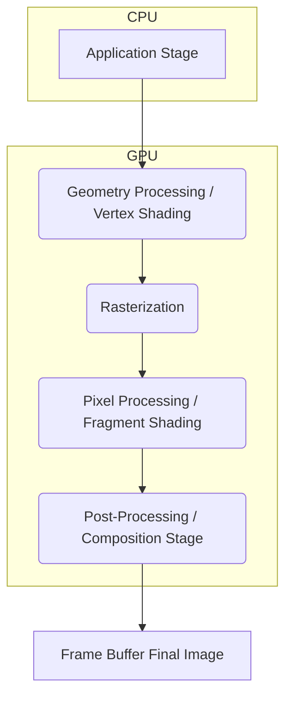

## **Overview**

At its core, the rendering pipeline is a sequence of stages that progressively transform 3D scene data into a final 2D image. Modern graphics engines like Unreal Engine and Unity rely heavily on this pipeline, which is executed primarily by the **Graphics Processing Unit (GPU)** due to its highly parallel architecture, making it incredibly efficient at handling the vast amounts of data and computations involved in rendering.

Here's a conceptual overview of the entire pipeline:



Now, let's break down each of these stages.


## **I. Application Stage**

* **Primary Goal/Purpose:** This stage is where the "brains" of your application or game reside. It's responsible for preparing all the data that the GPU needs to render a single frame. It handles game logic, physics simulations, animation updates, user input, and determines what needs to be rendered and how.
* **Key Operations/Tasks:**
    * **Scene Management:** Deciding which objects are visible (a process called **culling**, e.g., frustum culling).
    * **Animation:** Updating object positions, rotations, and scales based on animations.
    * **Physics Simulation:** Calculating object interactions and movements.
    * **Resource Management:** Loading textures, models, and other assets into memory.
    * **Sending Rendering Commands:** Preparing and sending data (like object geometry and material properties) and commands (like "draw this object") to the GPU.
* **Typical Inputs & Outputs:**
    * **Inputs:** User input, game state, AI decisions, physics calculations, animation data.
    * **Outputs:** Rendering commands, geometric data (vertices, indices), transformation matrices (model, view, projection), texture data, shader programs, and lighting information sent to the GPU.


    ```mermaid
        graph TD
            subgraph Application_Stage_CPU
                GL[Game Logic] --> AL;
                PE[Physics Engine] --> AL;
                UI[User Input] --> AL;
                AS[Animation System] --> AL;
                AL[Application Logic] --> SD[Scene Data & Rendering Commands];
            end

            GP[To Geometry Processing]
            SD --> GP;
    ```

---

## **II. Geometry Processing (Vertex Shading)**

* **Primary Goal/Purpose:** To transform the 3D models from their local "model space" into the 2D screen space that the viewer will see. It operates on the individual **vertices** of the 3D models.
    * **Vertex:** A point in 3D space that defines a corner of a **polygon**. Vertices usually carry other information like color, texture coordinates, and normals (vectors indicating the direction a surface is facing).
    * **Polygon:** A flat, multi-sided shape (typically triangles in computer graphics) that forms the surface of a 3D model.
* **Key Operations/Tasks:**
    * **Vertex Transformations:**
        * **Model Transformation:** Converts vertices from an object's local coordinate system (model space) to the global coordinate system (world space).
        * **View Transformation:** Converts vertices from world space to the camera's coordinate system (view space or eye space).
        * **Projection Transformation:** Transforms vertices from view space into a canonical view volume (clip space or normalized device coordinates - NDC), and then typically into screen space (2D coordinates). This is where perspective is applied, making objects further away appear smaller.
    * **Vertex Shading (Lighting):** Basic lighting calculations can be performed per vertex. The color of a vertex is computed based on light sources, material properties, and the vertex normal.
    * **Tessellation (Optional):** Dynamically subdividing polygons into smaller ones to add more detail to surfaces.
    * **Geometry Shaders (Optional):** Can create new geometry or modify existing geometry on the fly.
* **Typical Inputs & Outputs:**
    * **Inputs:** 3D model data (vertices, indices defining polygons), transformation matrices (model, view, projection), material properties, light information.
    * **Outputs:** Transformed vertices in clip space (or screen space), per-vertex attributes like color, texture coordinates, and normals, ready for rasterization.

    ```mermaid
    graph TD
        subgraph Geometry_Processing_GPU
            direction LR
            InputVertices["Input Vertices & Attributes, e.g., position, color, UVs, normals"] --> VS[Vertex Shader];
            Matrices["Transformation Matrices, e.g., Model, View, Projection, Light Info"] --> VS;
            VS -- Performs --> VT[Vertex Transformations];
            VS -- Performs --> VL[Per-Vertex Lighting];
            VS --> OutputVertices["Transformed & Shaded Vertices"];
        end
        OutputVertices --> RAST[To Rasterization];
    ```

---

## **III. Rasterization**

* **Primary Goal/Purpose:** To determine which pixels on the screen are covered by each geometric primitive (usually triangles) coming from the Geometry Processing stage. It converts vector graphics (defined by vertices and lines) into raster images (pixels).
* **Key Operations/Tasks:**
    * **Clipping:** Primitives that are outside the view frustum (the visible volume of the scene) are discarded or "clipped" to the boundaries of the frustum.
    * **Triangle Setup/Scan Conversion:** Calculates the screen-space representation of triangles and determines which pixels are inside each triangle.
    * **Perspective Correct Interpolation:** Attributes calculated at the vertices (like texture coordinates, colors, and normals) are interpolated across the surface of the triangle for each pixel. This interpolation needs to be "perspective correct" to avoid visual artifacts.
    * **Fragment Generation:** For each pixel covered by a triangle, a "fragment" is generated. A fragment is a potential pixel with associated data (interpolated color, depth, texture coordinates, etc.).
* **Typical Inputs & Outputs:**
    * **Inputs:** Transformed and clipped vertices (forming primitives like triangles), per-vertex attributes.
    * **Outputs:** A set of **fragments** for each primitive. Each fragment corresponds to a pixel on the screen and carries interpolated data (color, depth, texture coordinates).

    ```mermaid
    graph TD
        subgraph Rasterization_GPU
            TV[Transformed Vertices from Geometry Processing] --> Clip[Clipping];
            Clip --> TS[Triangle Setup / Scan Conversion];
            TS -- Generates --> Frags[Fragments with interpolated attributes: depth, color, UVs];
        end
        Frags --> PP[To Pixel Processing];
    ```

---

## **IV. Pixel Processing / Fragment Shading**

* **Primary Goal/Purpose:** To calculate the final color of each fragment generated by the rasterizer. This is where complex lighting, texturing, and other per-pixel effects are applied.
* **Key Operations/Tasks:**
    * **Texturing:** Applying **textures** (2D images or data) to the surfaces of objects. The interpolated texture coordinates (UVs) from the rasterizer are used to look up color values (texels) in the texture map.
        * **Texture:** An image used to add detail to the surface of a 3D model (e.g., wood grain, brick pattern).
    * **Per-Pixel Lighting:** More accurate lighting calculations are performed for each fragment, using interpolated normals, light properties, and material properties. This can include techniques like Phong shading or Blinn-Phong shading.
    * **Shader Effects:** Various special effects can be implemented here using **pixel shaders** (also known as fragment shaders).
    * **Depth Test (Z-buffering):** This is a crucial step for hidden surface removal. The depth value (Z-value) of the current fragment is compared to the depth value already stored in the **Z-buffer** (or depth buffer) for that pixel. If the current fragment is closer to the camera (has a smaller Z-value), its color and new depth value are written to the **frame buffer** and Z-buffer, respectively. Otherwise, the fragment is discarded.
        * **Z-buffer (Depth Buffer):** A 2D array that stores the depth value (distance from the camera) for each pixel on the screen.
        * **Frame Buffer:** A region of memory that holds the pixel data for the image currently being displayed or being prepared for display. It typically contains a color buffer, depth buffer, and stencil buffer.
    * **Stencil Test:** Allows for more complex masking operations, often used for effects like shadows or reflections.
    * **Blending:** Combining the color of the current fragment with the color already in the frame buffer, often used for transparency effects.
* **Typical Inputs & Outputs:**
    * **Inputs:** Fragments with interpolated attributes (depth, color, texture coordinates, normals), textures, material properties, light information, contents of the frame buffer (for blending) and Z-buffer.
    * **Outputs:** Final pixel colors written to the color buffer of the frame buffer, and updated depth values written to the Z-buffer.


    ```mermaid
    graph TD
        subgraph Pixel_Processing_GPU
            direction LR
            FragsIn["Fragments (interpolated attributes) from Rasterization"] --> PS[Pixel Shader];
            Tex["Texture Data"] --> PS;
            Mats["Material Properties"] --> PS;
            Lights["Light Information"] --> PS;
            PS -- Computes --> Col[Computed Fragment Color & Depth];
            Col --> DT[Depth Test, i.e., Z-Buffering];
            FB_In["Current Frame Buffer Color & Depth"] --> DT;
            DT --> Blend[Blending, if necessary];
            FB_In2["Current Frame Buffer Color"] --> Blend;
            Blend --> FinalPixel["Final Pixel Color & Depth"];
        end
        FinalPixel --> FB_Out[To Frame Buffer];
    ```

---

## **V. Post-Processing / Composition Stage**

* **Primary Goal/Purpose:** To apply full-screen effects to the rendered image before it's displayed. This stage operates on the entire rendered image (or intermediate buffers) rather than individual geometric primitives or pixels.
* **Key Operations/Tasks:**
    * **Tone Mapping:** Adjusting the range of color values in the rendered image to match the display capabilities of the screen (e.g., converting High Dynamic Range (HDR) images to Low Dynamic Range (LDR)).
    * **Color Correction/Grading:** Adjusting the overall color balance, brightness, and contrast of the image.
    * **Anti-aliasing:** Smoothing out jagged edges (aliasing) that can appear on an image due to the discrete nature of pixels (e.g., FXAA, MSAA, TAA).
    * **Bloom:** Creating a glow effect around bright areas of the image.
    * **Depth of Field:** Simulating the effect of a camera lens where objects outside a certain range of distances appear blurred.
    * **Motion Blur:** Blurring objects based on their motion or the camera's motion to simulate how our eyes perceive fast movement.
    * **Screen Space Ambient Occlusion (SSAO):** Approximating ambient occlusion (how much ambient light a point on a surface receives) based on the depth buffer, adding subtle shadows and enhancing visual depth.
    * **User Interface (UI) Overlay:** Drawing UI elements (like health bars, menus) on top of the rendered scene.
* **Typical Inputs & Outputs:**
    * **Inputs:** The rendered 2D image from the frame buffer (color buffer), potentially the depth buffer, and other intermediate buffers.
    * **Outputs:** The final 2D image that will be sent to the display device.

    ```mermaid
    graph TD
        subgraph Post_Processing_GPU
            direction LR
            RenderedImage["Rendered Image from Frame Buffer, i.e., Color Buffer"] --> PPE1[Effect 1, e.g., Tone Mapping];
            DepthBuffer["Depth Buffer, Other G-Buffers"] --> PPE1;
            PPE1 --> PPE2[Effect 2, e.g., Anti-aliasing];
            PPE2 --> PPEn[Effect N, e.g., Bloom, UI Overlay];
            PPEn --> FinalImage[Final Image for Display];
        end
    ```

---

## **Summary**


1.  The **Application Stage** (CPU) first decides what needs to be drawn and gathers all the necessary data (models, textures, camera position, lights).
2.  This data is sent to the GPU, where **Geometry Processing** transforms all the 3D vertex data into the correct screen positions and performs initial lighting.
3.  **Rasterization** then figures out which screen pixels are covered by these transformed 3D shapes (triangles) and generates "fragments" for each covered pixel, interpolating data like color and texture coordinates across the triangle's surface.
4.  **Pixel Processing** takes these fragments and calculates their final color. This is where detailed texturing, complex lighting, and shadows are applied. The crucial depth test ensures that objects closer to the viewer correctly obscure those further away. The results are written to the frame buffer.
5.  Finally, the **Post-Processing/Composition Stage** takes the complete rendered image from the frame buffer and applies full-screen effects like bloom, color correction, or anti-aliasing to enhance the visual quality before sending it to your monitor.
